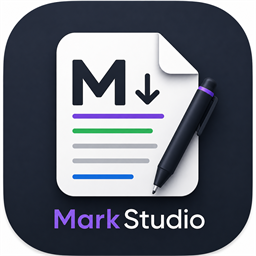
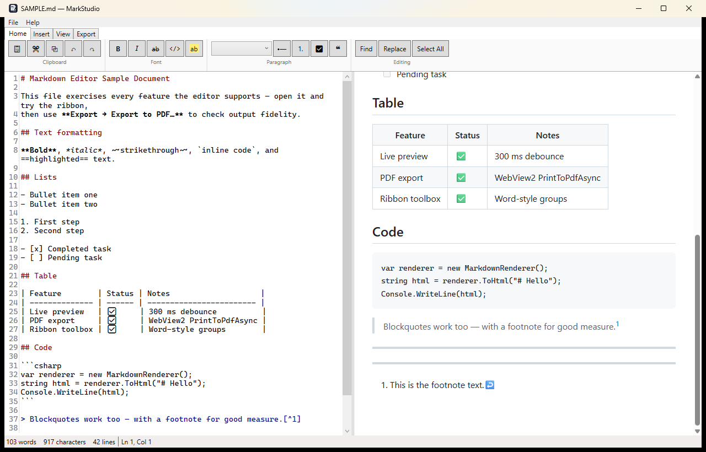
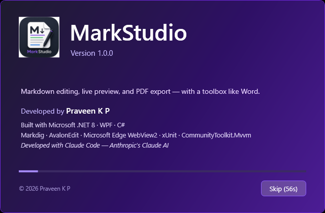
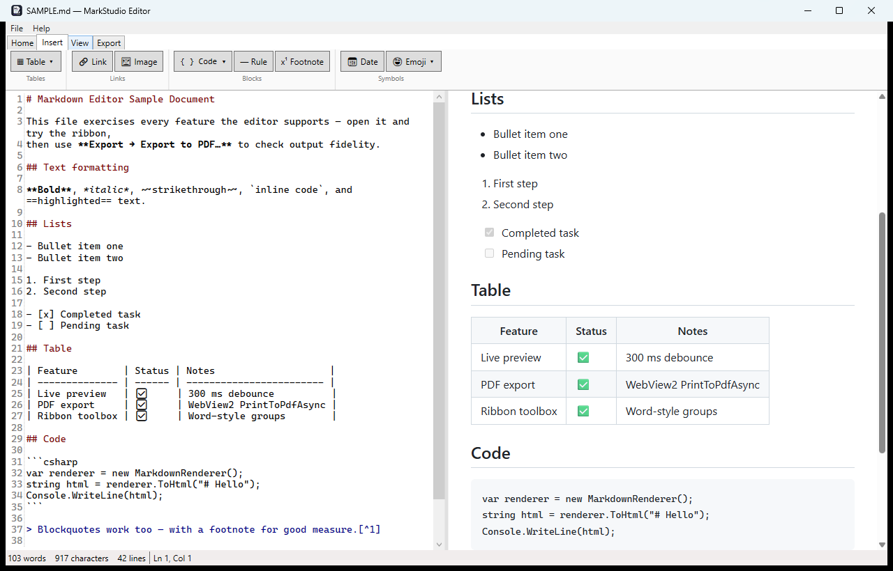

<p align="center">
  
</p>

<h1 align="center">MarkStudio Editor</h1>

<p align="center">
  A Windows Markdown document viewer &amp; editor with a <b>Microsoft Word–style toolbox</b>,
  live preview, and <b>PDF export</b> — so you can write Markdown without memorizing Markdown.
</p>

<p align="center">
  <a href="https://apps.microsoft.com/detail/9N1LCTH35QP5"><b>🛒 Get it from the Microsoft Store</b></a>
  &nbsp;·&nbsp;
  <a href="https://github.com/praveen-k-prasannan-dev/MarkStudio/releases/latest"><b>⬇ Download the .zip directly</b></a>
</p>

---



*The main window: ribbon toolbox on top, Markdown source with syntax highlighting on the left, live rendered preview on the right, word count and caret position in the status bar.*

## Features

- **Word-style ribbon** — click Bold, Headings, Lists, Table… instead of typing Markdown syntax. Every button toggles like Word (Bold on bold text un-bolds it) and has a keyboard shortcut.
- **Live preview** — GitHub-style rendering that updates as you type, with synchronized scrolling, light/dark themes, and a clickable document outline.
- **Table grid picker** — hover a grid to insert an N×M table, exactly like Word's Insert → Table.
- **Export** — PDF with page setup (A4/Letter, orientation, margins), standalone HTML, and printing.
- **Everyday comfort** — recent files, find & replace, autosave with crash recovery, drag-and-drop for documents *and* images, persistent settings, footnotes, emoji, task lists.

## Install

### Option A — Microsoft Store (recommended)

**[Get MarkStudio Editor from the Microsoft Store](https://apps.microsoft.com/detail/9N1LCTH35QP5)** — one click to install, no SmartScreen warning (Microsoft signs the package), and automatic updates whenever a new version ships.

### Option B — Direct download (.zip)

MarkStudio Editor also ships as a **self-contained bundle** — the target PC needs **no Visual Studio and no .NET installation**.

1. Go to the **[Releases page](https://github.com/praveen-k-prasannan-dev/MarkStudio/releases/latest)** and download `MarkStudioEditor-1.0.0-win-x64.zip` (~64 MB).
2. Right-click the downloaded zip → **Extract All…** → choose any folder (e.g. `C:\Apps\MarkStudioEditor`).
   Keep the extracted files together: `MarkStudioEditor.exe` and the `Assets` folder belong side by side.
3. Double-click **`MarkStudioEditor.exe`**. The first launch takes a few extra seconds while the bundled .NET runtime unpacks itself.
4. If Windows SmartScreen shows *"Windows protected your PC"* (the exe is not code-signed), click **More info → Run anyway**.

You can also open a document directly: drag any `.md` file onto `MarkStudioEditor.exe`, or run
`MarkStudioEditor.exe "C:\path\to\notes.md"`.

> **Requirements:** Windows 10 (64-bit) or Windows 11. The preview pane uses the **Microsoft Edge WebView2 Runtime**, which is already present on Windows 11 and on any PC with Microsoft Edge. If it's missing, the app shows a friendly message with the [free download link](https://developer.microsoft.com/microsoft-edge/webview2/).

## The splash screen



On startup MarkStudio Editor shows a Visual Studio-style splash with the version, credits, and a progress bar. It displays for 60 seconds — click **Skip** to jump straight into the editor.

## Using the application

### Title bar and window

The title bar shows the current document name, a `●` marker when there are **unsaved changes** (e.g. `notes.md ● — MarkStudio Editor`), and the standard minimize/maximize/close controls. Closing with unsaved changes always asks *Save / Don't save / Cancel* — you can't lose work by accident. The window size, position, and your view preferences are remembered between sessions.

### Menu bar

| Menu | Contents |
|------|----------|
| **File** | New (`Ctrl+N`), Open (`Ctrl+O`), **Open Recent** (last 10 files), Save (`Ctrl+S`), Save As (`Ctrl+Shift+S`), Exit |
| **Help** | About MarkStudio Editor (version and credits) |

### The ribbon toolbox

The ribbon has four tabs, like Word:

**Home** — everyday formatting:
| Group | Controls |
|-------|----------|
| Clipboard | Paste, Cut, Copy, Undo, Redo |
| Font | **Bold** `Ctrl+B` · *Italic* `Ctrl+I` · ~~Strikethrough~~ `Ctrl+Shift+X` · `inline code` `Ctrl+Shift+C` · highlight `Ctrl+Shift+H` |
| Paragraph | Heading dropdown (Normal, H1–H6; also `Ctrl+1`…`Ctrl+6`, `Ctrl+0` for normal) · bullet list `Ctrl+Shift+8` · numbered list `Ctrl+Shift+7` · task list `Ctrl+Shift+9` · blockquote `Ctrl+Shift+Q` |
| Editing | Find `Ctrl+F` · Replace `Ctrl+H` · Select All |

Every formatting button is a **toggle**: select text and click Bold to make it `**bold**`; click again to remove it. With nothing selected, the markers are inserted and the caret lands between them, ready to type.

**Insert** — content blocks:



| Group | Controls |
|-------|----------|
| Tables | **Table ▾** opens the Word-style hover grid picker; *Insert Table…* opens a rows/columns dialog |
| Links | Link `Ctrl+K` (dialog for text + URL) · Image `Ctrl+Shift+I` (file browser; paths are made relative to your document automatically) |
| Blocks | Code block with language menu (`csharp`, `python`, `sql`, …) `Ctrl+Shift+K` · Horizontal rule · Footnote |
| Symbols | Date/time stamp · Emoji menu |

**View** — layout and appearance:
| Group | Controls |
|-------|----------|
| Layout | **Split** / **Editor only** / **Preview only** |
| Preview | Sync scrolling on/off · 🌙 Dark preview theme |
| Editor font | A− / A+ text size |
| Panels | ☰ **Outline** — a headings tree; click any heading to jump there |

**Export** — output:
| Group | Controls |
|-------|----------|
| Export | **Export to PDF…** (page size, orientation, margins, backgrounds) · Export to HTML · Print `Ctrl+P` |

The PDF is rendered by the same engine as the preview, so **what you see is exactly what you get**.

### Find & Replace

`Ctrl+F` opens the find bar under the ribbon (`Ctrl+H` focuses the replace field). Find Next/Previous wrap around the document; Replace All reports how many occurrences changed; Match case is optional. Press `Esc` to close.

### Drag & drop

- Drop a **`.md` file** anywhere on the window → it opens (with an unsaved-changes prompt if needed).
- Drop an **image file** → it's copied to an `assets/` folder next to your document and inserted as ``.

### Autosave & recovery

While you have unsaved changes, a recovery draft is written every 60 seconds. If the app is ever killed (power loss, crash), the next start offers to restore your unsaved work.

## Building from source

```powershell
git clone https://github.com/praveen-k-prasannan-dev/MarkStudio.git
cd MarkStudio
dotnet build                                   # requires .NET SDK 8 or newer
dotnet test                                    # 72 unit tests
dotnet run --project src/MarkdownEditor.App    # run the app
.\scripts\publish.ps1                          # build the redistributable bundle + zip
```

## Project structure

```
MarkStudio/                                 (repository)
├── src/
│   ├── MarkdownEditor.Core/            # ALL logic — a UI-free .NET 8 class library
│   │   ├── Markdown/                   #   Markdig pipeline → HTML, full-page builder
│   │   ├── Editing/                    #   inline/block/list formatters, table builder
│   │   ├── Documents/                  #   document state, word/char/line statistics
│   │   └── Services/                   #   file I/O, recent-files list
│   └── MarkdownEditor.App/             # WPF shell (thin — no business logic)
│       ├── MainWindow.xaml(.cs)        #   window, editor, live preview, file handling
│       ├── MainWindow.Ribbon.cs        #   ribbon commands → Core formatters
│       ├── MainWindow.Export.cs        #   PDF/HTML export, print
│       ├── MainWindow.Polish.cs        #   settings, autosave, drag-drop, About
│       ├── ViewModels/                 #   MVVM view model (title, status bar)
│       ├── Views/                      #   dialogs: link, image, table, PDF, splash
│       ├── Services/                   #   settings store, diagnostic log
│       └── Assets/                     #   app icon, preview CSS themes
├── tests/
│   └── MarkdownEditor.Core.Tests/      # 72 xUnit tests for the Core library
├── scripts/publish.ps1                 # one-command redistributable bundle
├── BUILD_PLAN.md                       # the complete phased build plan (all checked ✓)
└── SAMPLE.md                           # demo document exercising every feature
```

The architecture rule: **anything testable without a window lives in `MarkdownEditor.Core`** — the renderer, every formatter the ribbon calls, document state, statistics, and services are all plain C# covered by unit tests. The WPF app only wires them to controls.

## Tech stack

| Concern | Library |
|---------|---------|
| UI | WPF on .NET 8 (C#) |
| Markdown engine | [Markdig](https://github.com/xoofx/markdig) |
| Source editor | [AvalonEdit](https://github.com/icsharpcode/AvalonEdit) |
| Preview & PDF | [Microsoft Edge WebView2](https://developer.microsoft.com/microsoft-edge/webview2/) (`PrintToPdfAsync`) |
| MVVM | CommunityToolkit.Mvvm |
| Tests | xUnit + FluentAssertions |

## How this app was built — an AI development story

MarkStudio Editor was developed by **Praveen K P** in a pair-programming session with **Claude Code**, powered by Anthropic's **Claude Fable** model (the first model of the Claude 5 family). The entire project — plan, code, tests, branding, packaging, and the release — was built through conversation.

The timeline below comes straight from the git history (2026-07-17 → 2026-07-18):

| Stage | What was produced | Time |
|-------|-------------------|------|
| Build plan | `BUILD_PLAN.md` — the full phased plan with test strategy | ~5 minutes |
| Phases 0–2 | Solution scaffolding, rendering engine, complete editing engine, **72 unit tests** | committed across ~5 hours of a working day (including developer review/breaks) |
| Phases 3–6 | Full WPF app: window, live preview, entire ribbon, dialogs, PDF/HTML export, autosave, settings | the final four phases were committed **within 14 minutes of each other** |
| Branding | App icon, VS-style splash screen, custom artwork integration | ~1 hour including design choices |
| Ship it | Self-contained bundle, GitHub repo, SSH setup, v1.0.0 release with assets | ~1 hour |

A few numbers worth noting:

- **~40 source files, ~4,500 lines** of C#/XAML/CSS written across the session.
- **One single compile error** occurred during the entire build (a XAML escaping detail) — everything else built and passed its tests on the first attempt.
- All **72 unit tests were written before or alongside** the code they verify, and never went red.

**How does this compare?** Rough, honest estimates rather than benchmarks: a solo developer building this from scratch — learning Markdig's pipeline quirks, AvalonEdit's selection APIs, WebView2's PDF settings, plus writing the test suite — would typically need **two to four weeks**. Smaller/faster AI models can generate individual files quickly but tend to lose the thread on a multi-project architecture like this one (Core/App/Tests separation, a 7-phase plan, toggle-behavior contracts), requiring many more correction cycles. What distinguishes the Fable-class model in this project was **first-pass correctness at scale**: holding the whole plan in mind for hours, writing test-first code that passed immediately, and diagnosing environment-level issues (a corporate NuGet feed, a licensing change in a test library, phantom window interactions in a sandbox) without derailing the build.

*This README — including its screenshots, captured by the model running the app itself — was, of course, also written by Claude.*

## Credits

Developed by **Praveen K P** · Built with Claude Code (Anthropic Claude Fable) · © 2026
