<p align="center">
  
</p>

<h1 align="center">MarkStudio Editor</h1>

<p align="center">
  A Windows Markdown document viewer &amp; editor with a <b>Microsoft Word–style toolbox</b>,
  live preview, and <b>PDF export</b> — so you can write Markdown without memorizing Markdown.
</p>

<p align="center">
  <a href="https://apps.microsoft.com/detail/9N1LCTH35QP5"><b>🛒 Get it from the Microsoft Store</b></a>
  &nbsp;·&nbsp;
  <a href="https://github.com/praveen-k-prasannan-dev/MarkStudio/releases/latest"><b>⬇ Download the .zip directly</b></a>
</p>

---

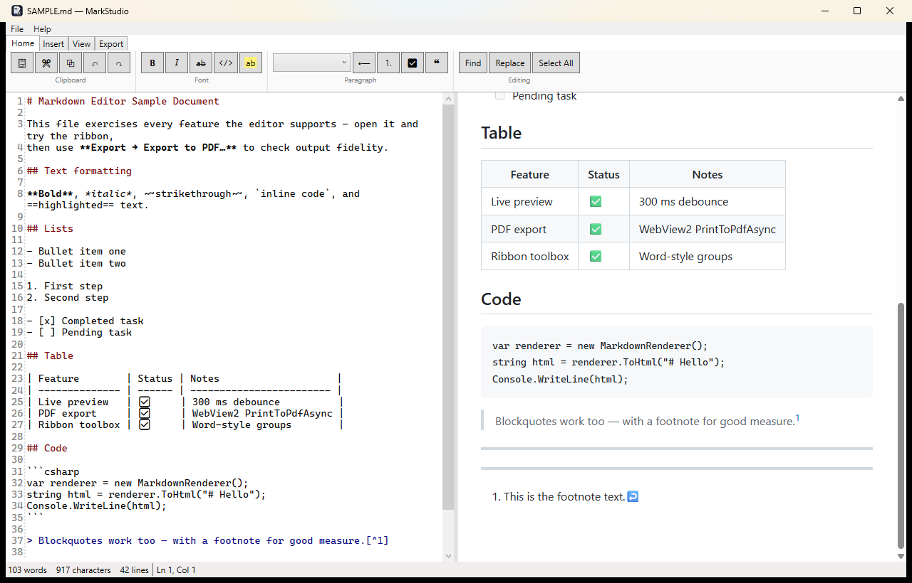

*The main window: ribbon toolbox on top, Markdown source with syntax highlighting on the left, live rendered preview on the right, word count and caret position in the status bar.*

## Features

- **Word-style ribbon** — click Bold, Headings, Lists, Table… instead of typing Markdown syntax. Every button toggles like Word (Bold on bold text un-bolds it) and has a keyboard shortcut.
- **Interactive table editing** — `Tab`/`Shift+Tab` jump between cells like Excel (tabbing past the last cell grows the table automatically); a contextual **Table** ribbon tab and a right-click submenu let you insert/delete rows and columns without leaving the keyboard.
- **Live preview** — GitHub-style rendering that updates as you type, with synchronized scrolling, a clickable document outline, and a **Light / Dark / Custom** theme picker (bring your own CSS).
- **Table grid picker** — hover a grid to insert an N×M table, exactly like Word's Insert → Table.
- **Copy as HTML** — copy your selection as real formatted HTML, so pasting into Word, Outlook, or a browser reproduces the formatting instead of raw Markdown syntax.
- **Right-click context menu** — Cut/Copy/Paste/Undo/Redo, Bold/Italic/Insert Link, spelling suggestions, and (inside a table) the same row/column commands as the ribbon.
- **Export** — PDF with page setup (A4/Letter, orientation, margins), standalone HTML, and printing.
- **Command palette** (`Ctrl+Shift+P`) — a VS Code-style searchable list of every command the ribbon can do, plus contextual table actions when the caret is inside a table.
- **Multiple documents** — open several files at once in tabs, each with its own undo history and dirty state; switching tabs is instant.
- **Spell checking** — misspelled words get a dotted red underline as you type; right-click for suggestions or to add a word to the dictionary.
- **Mermaid diagrams & math formulas** — fenced ` ```mermaid ` blocks and `$LaTeX$` render live in the preview, loaded only when a document actually uses them.
- **Focus mode** (`F11`) — hides the ribbon, tab strip, and status bar and centers the editor for distraction-free writing.
- **Writing stats** — tracks words written per day, a trailing 7-day total, and a writing streak.
- **Templates & snippets** — start a new document from a template (Meeting Notes, README, Changelog…), or type a trigger word like `todo`/`table`/`meeting`/`code` and press `Tab` to expand it.
- **Workspace mode** — open a folder as a sidebar file tree with instant search across every Markdown file in it; clicking a relative link to another `.md` file in the preview opens it in a new tab instead of navigating away.
- **Export to Word** — native `.docx` export (headings, formatting, links, lists, tables) built directly from the Markdown structure, not a HTML round-trip.
- **Everyday comfort** — recent files, find & replace, reading-time estimate, autosave with crash recovery, drag-and-drop for documents *and* images, persistent settings, footnotes, emoji, task lists.

## Install

### Option A — Microsoft Store (recommended)

**[Get MarkStudio Editor from the Microsoft Store](https://apps.microsoft.com/detail/9N1LCTH35QP5)** — one click to install, no SmartScreen warning (Microsoft signs the package), and automatic updates whenever a new version ships.

### Option B — Direct download (.zip)

MarkStudio Editor also ships as a **self-contained bundle** — the target PC needs **no Visual Studio and no .NET installation**.

1. Go to the **[Releases page](https://github.com/praveen-k-prasannan-dev/MarkStudio/releases/latest)** and download `MarkStudioEditor-1.3.0-win-x64.zip` (~68 MB).
2. Right-click the downloaded zip → **Extract All…** → choose any folder (e.g. `C:\Apps\MarkStudioEditor`).
   Keep the extracted files together: `MarkStudioEditor.exe` and the `Assets` folder belong side by side.
3. Double-click **`MarkStudioEditor.exe`**. The first launch takes a few extra seconds while the bundled .NET runtime unpacks itself.
4. If Windows SmartScreen shows *"Windows protected your PC"* (the exe is not code-signed), click **More info → Run anyway**.

You can also open a document directly: drag any `.md` file onto `MarkStudioEditor.exe`, or run
`MarkStudioEditor.exe "C:\path\to\notes.md"`.

> **Requirements:** Windows 10 (64-bit) or Windows 11. The preview pane uses the **Microsoft Edge WebView2 Runtime**, which is already present on Windows 11 and on any PC with Microsoft Edge. If it's missing, the app shows a friendly message with the [free download link](https://developer.microsoft.com/microsoft-edge/webview2/).

## The splash screen

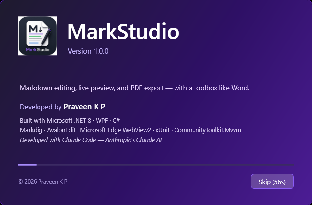

On startup MarkStudio Editor shows a Visual Studio-style splash with the version, credits, and a progress bar. It displays for 60 seconds — click **Skip** to jump straight into the editor.

## Using the application

### Title bar and window

The title bar shows the current document name, a `●` marker when there are **unsaved changes** (e.g. `notes.md ● — MarkStudio Editor`), and the standard minimize/maximize/close controls. Closing with unsaved changes always asks *Save / Don't save / Cancel* — you can't lose work by accident. The window size, position, and your view preferences are remembered between sessions.

### Menu bar

| Menu | Contents |
|------|----------|
| **File** | New (`Ctrl+N`), Open (`Ctrl+O`), **Open Recent** (last 10 files), Save (`Ctrl+S`), Save As (`Ctrl+Shift+S`), Exit |
| **Help** | About MarkStudio Editor (version and credits) |

### Multiple documents (tabs)

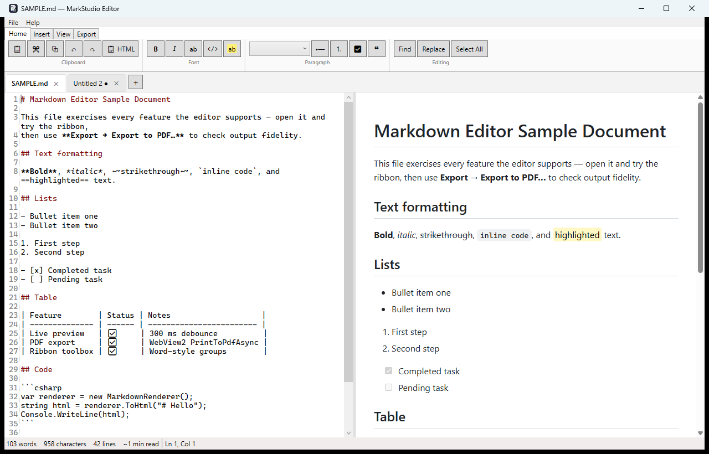

Open several files at once — each gets its own tab, its own undo history, and its own dirty indicator. Click **+** (or `Ctrl+N`) for a new tab; new untitled documents are numbered ("Untitled", "Untitled 2", …) so you can tell them apart. Opening a file that's already open in a tab switches to it instead of duplicating it. Closing a tab with unsaved changes prompts to save, just like closing the window.

### Command palette

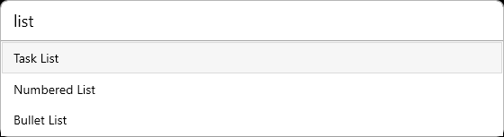

`Ctrl+Shift+P` opens a VS Code-style searchable list of every command the ribbon can do — type a few letters (fuzzy matching, so "list" finds Bullet/Numbered/Task List) and press `Enter` to run it. When the caret is inside a table, the palette also lists the row/column commands.

### The ribbon toolbox

The ribbon has four tabs, like Word:

**Home** — everyday formatting:
| Group | Controls |
|-------|----------|
| Clipboard | Paste, Cut, Copy, Undo, Redo, **Copy as HTML** |
| Font | **Bold** `Ctrl+B` · *Italic* `Ctrl+I` · ~~Strikethrough~~ `Ctrl+Shift+X` · `inline code` `Ctrl+Shift+C` · highlight `Ctrl+Shift+H` |
| Paragraph | Heading dropdown (Normal, H1–H6; also `Ctrl+1`…`Ctrl+6`, `Ctrl+0` for normal) · bullet list `Ctrl+Shift+8` · numbered list `Ctrl+Shift+7` · task list `Ctrl+Shift+9` · blockquote `Ctrl+Shift+Q` |
| Editing | Find `Ctrl+F` · Replace `Ctrl+H` · Select All |

**Table** — appears only while the caret is inside a table (like Word's Table Tools):
| Group | Controls |
|-------|----------|
| Rows | Insert Row Above · Insert Row Below · Delete Row |
| Columns | Insert Column Left · Insert Column Right · Delete Column |

Every formatting button is a **toggle**: select text and click Bold to make it `**bold**`; click again to remove it. With nothing selected, the markers are inserted and the caret lands between them, ready to type.

**Insert** — content blocks:

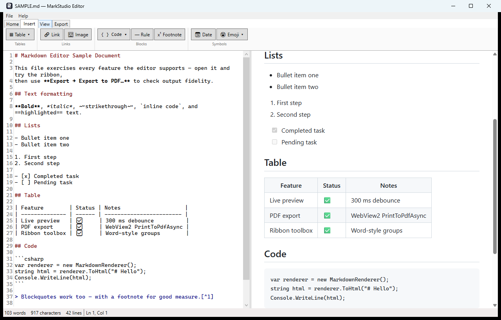

| Group | Controls |
|-------|----------|
| Tables | **Table ▾** opens the Word-style hover grid picker; *Insert Table…* opens a rows/columns dialog |
| Links | Link `Ctrl+K` (dialog for text + URL) · Image `Ctrl+Shift+I` (file browser; paths are made relative to your document automatically) |
| Blocks | Code block with language menu (`csharp`, `python`, `sql`, …) `Ctrl+Shift+K` · Horizontal rule · Footnote |
| Symbols | Date/time stamp · Emoji menu |

**View** — layout and appearance:
| Group | Controls |
|-------|----------|
| Layout | **Split** / **Editor only** / **Preview only** |
| Preview | Sync scrolling on/off · **Theme**: Light / Dark / Custom… (pick any `.css` file, remembered across restarts) |
| Editor font | A− / A+ text size |
| Panels | ☰ **Outline** — a headings tree; click any heading to jump there · 🗀 **Workspace** — a folder file tree with search |
| Focus | 🎯 **Focus Mode** (`F11`) — distraction-free writing |
| Writing Stats | 📊 **Stats** — today's word count, last 7 days, and your writing streak |

**Export** — output:

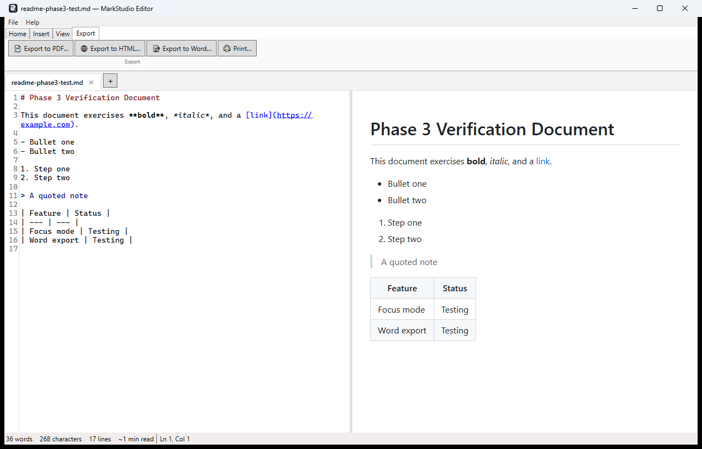

| Group | Controls |
|-------|----------|
| Export | **Export to PDF…** (page size, orientation, margins, backgrounds) · **Export to Word…** (native `.docx`) · Export to HTML · Print `Ctrl+P` |

The PDF is rendered by the same engine as the preview, so **what you see is exactly what you get**.

### Focus mode

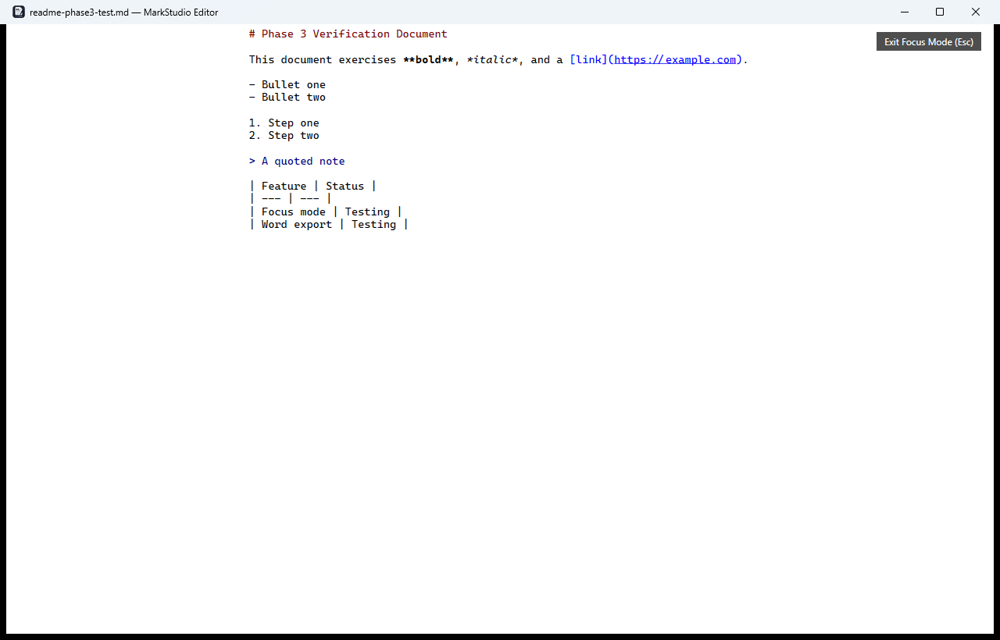

`F11` (or View tab → Focus Mode) hides the ribbon, document tabs, and status bar, and centers the editor in a comfortable column for distraction-free writing. A small **Exit Focus Mode** button appears in the corner; `Esc`, `F11` again, or that button all restore your previous layout exactly (view mode, Outline/Workspace panel state, line numbers).

### Writing stats

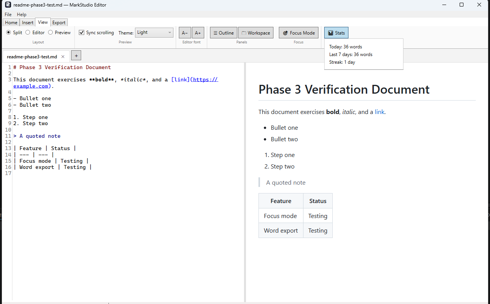

View tab → **Stats** shows how many words you've written today, over the last 7 days, and your current daily writing streak. "Words written" only counts net *increases* in word count sampled as you type, so deleting text doesn't count against you — stats are saved between sessions.

### Templates & snippets

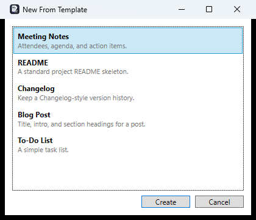

**File → New From Template…** opens a picker with ready-made starting points: Meeting Notes, README, Changelog, Blog Post, and To-Do List. Pick one (or double-click it) and a new tab opens pre-filled with that structure.

For quicker inline expansion, type one of these trigger words on its own and press `Tab`:

| Trigger | Expands to |
|---------|-----------|
| `todo` | A task-list checkbox, ready to type |
| `table` | A 3-column table skeleton |
| `meeting` | A full Meeting Notes structure (Date/Attendees/Agenda/Action Items) |
| `code` | A fenced code block with the cursor inside |

Snippet expansion only triggers on Tab when the caret isn't inside a table (where Tab still means "next cell", exactly as before).

### Workspace mode

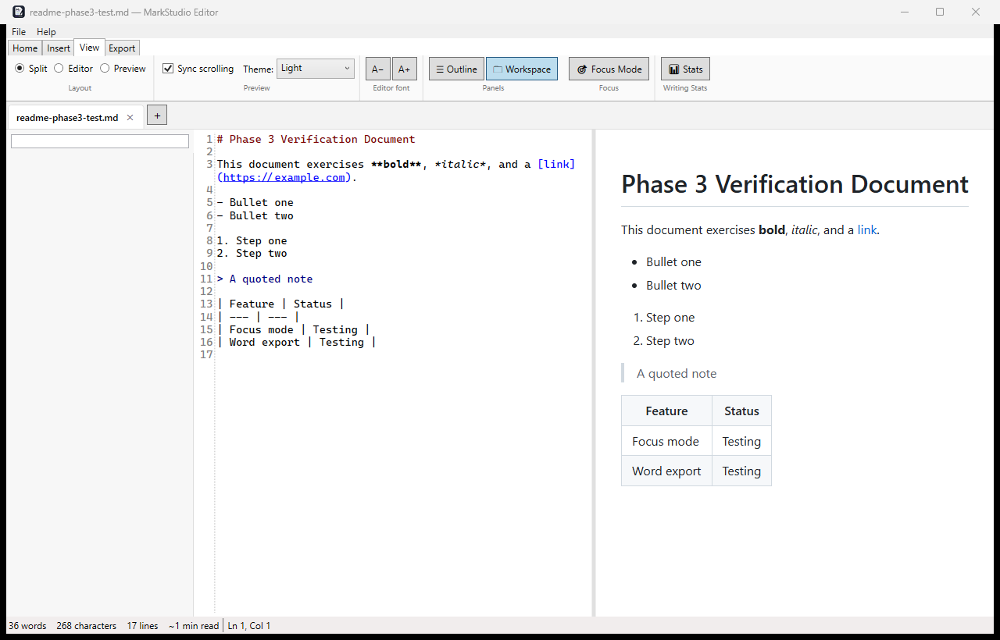

**File → Open Folder…** (or View tab → Workspace) scans a folder into a sidebar file tree of just its Markdown files — noise folders like `.git`, `node_modules`, `bin`, and `obj` are skipped automatically. Click a file to open it in a new tab. Type in the search box above the tree to instantly search every file in the folder line-by-line; double-click a result to jump straight to that line.

Clicking a relative link to another `.md` file in the **preview pane** (e.g. `[notes](other.md)`) now opens that file in a new tab instead of navigating the preview away from your rendered document. Links to `https://` URLs open in your default browser instead.

### Export to Word

Export tab → **Export to Word…** builds a native `.docx` file directly from the document's Markdown structure (not by converting the HTML preview), so headings, **bold**/*italic*/~~strikethrough~~/`code`, links, bullet/numbered/task lists, blockquotes, code blocks, and tables all map onto real Word formatting. Two deliberate v1 simplifications: images become a `[Image: alt text]` placeholder rather than being embedded, and lists render as literal bullet/number/checkbox text rather than Word's native auto-numbering.

### Interactive table editing

Click into any table cell and a contextual **Table** tab appears in the ribbon. A few ways to edit tables quickly:

- **`Tab`** jumps to the next cell, selecting its contents (type to replace, like Excel). Tabbing past the last cell of the last row automatically adds a new row and moves into it.
- **`Shift+Tab`** jumps to the previous cell.
- The **Table** ribbon tab and the **right-click menu** (see below) both offer Insert Row Above/Below, Delete Row, Insert Column Left/Right, and Delete Column.

### Right-click context menu

Right-click anywhere in the editor for Cut, Copy, Paste, Undo, Redo, Bold, Italic, Insert Link, and Select All. Right-click while inside a table and a **Table** submenu is added with the same row/column commands as the ribbon tab — it only appears when relevant. Right-click a misspelled word and a **Spelling** submenu with suggested corrections appears at the top (see below).

### Spell checking

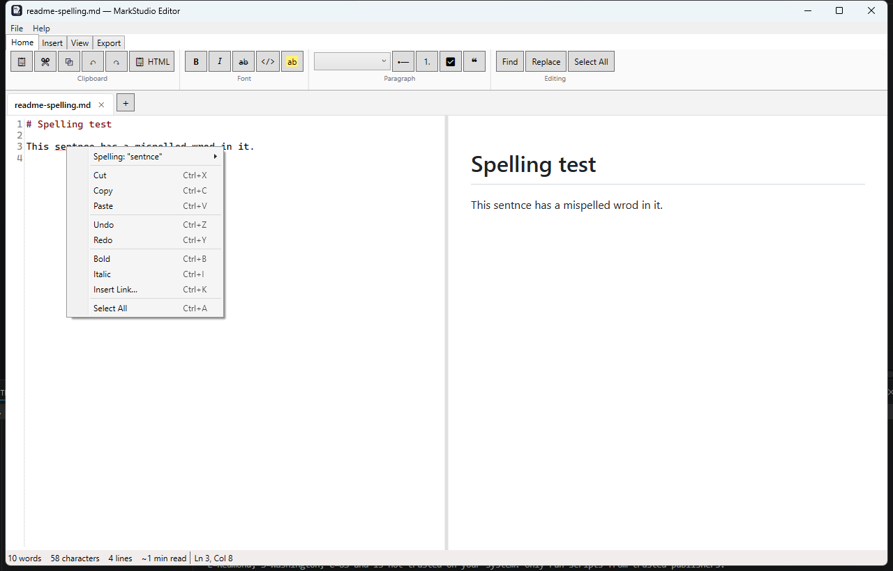

Misspelled words get a dotted red underline as you type. Right-click one for up to five suggested corrections or **Add to Dictionary** to stop it being flagged — useful for names and technical terms. Code blocks, inline code, and URLs are never spell-checked.

### Mermaid diagrams and math formulas

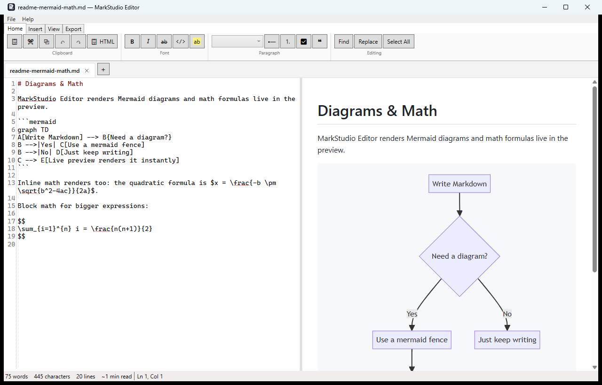

Fence a block with ` ```mermaid ` and it renders as an actual diagram (flowcharts, sequence diagrams, and everything else [Mermaid](https://mermaid.js.org/) supports) instead of code text.

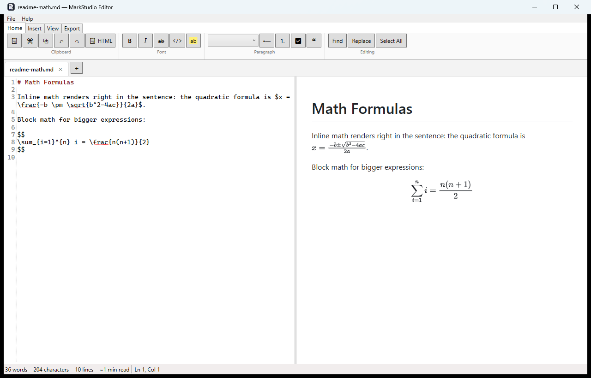

Math works the same way: `$inline math$` renders in the sentence, and a `$$` block on its own lines renders as a larger, centered formula. Both libraries are bundled locally and load only when a document actually contains a diagram or formula, so ordinary documents preview exactly as fast as before.

### Find & Replace

`Ctrl+F` opens the find bar under the ribbon (`Ctrl+H` focuses the replace field). Find Next/Previous wrap around the document; Replace All reports how many occurrences changed; Match case is optional. Press `Esc` to close.

### Drag & drop

- Drop a **`.md` file** anywhere on the window → it opens (with an unsaved-changes prompt if needed).
- Drop an **image file** → it's copied to an `assets/` folder next to your document and inserted as ``.

### Autosave & recovery

While you have unsaved changes, a recovery draft is written every 60 seconds. If the app is ever killed (power loss, crash), the next start offers to restore your unsaved work.

## Building from source

```powershell
git clone https://github.com/praveen-k-prasannan-dev/MarkStudio.git
cd MarkStudio
dotnet build                                   # requires .NET SDK 8 or newer
dotnet test                                    # 189 unit tests
dotnet run --project src/MarkdownEditor.App    # run the app
.\scripts\publish.ps1                          # build the redistributable bundle + zip
```

## Project structure

```
MarkStudio/                                 (repository)
├── src/
│   ├── MarkdownEditor.Core/            # ALL logic — a UI-free .NET 8 class library
│   │   ├── Markdown/                   #   Markdig pipeline → HTML, full-page builder, Mermaid/math wiring
│   │   ├── Editing/                    #   inline/block/list/table formatters, snippet expansion
│   │   ├── Documents/                  #   document state/statistics, DocumentManager, templates, writing stats
│   │   ├── Clipboard/                  #   CF_HTML clipboard formatter (Copy as HTML)
│   │   ├── Palette/                    #   fuzzy matcher powering the command palette
│   │   ├── Spelling/                   #   Hunspell-backed spell checker + Markdown-aware scanner
│   │   ├── Workspace/                  #   folder → file-tree scanning, cross-file text search
│   │   ├── Export/                     #   Markdig AST → native .docx via the OpenXML SDK
│   │   └── Services/                   #   file I/O, recent-files list
│   └── MarkdownEditor.App/             # WPF shell (thin — no business logic)
│       ├── MainWindow.xaml(.cs)        #   window, editor, live preview, file handling
│       ├── MainWindow.Ribbon.cs        #   ribbon commands → Core formatters
│       ├── MainWindow.TableEditing.cs  #   contextual Table tab, Tab/Shift+Tab cell navigation
│       ├── MainWindow.Tabs.cs          #   multi-tab document management
│       ├── MainWindow.CommandPalette.cs#   Ctrl+Shift+P command registry
│       ├── MainWindow.SpellCheck.cs    #   spell-check scanning, underline decoration, suggestions
│       ├── MainWindow.FocusMode.cs     #   F11 distraction-free writing
│       ├── MainWindow.WritingStats.cs  #   daily word-count tracking, streaks
│       ├── MainWindow.Snippets.cs      #   Tab-to-expand snippets, New From Template
│       ├── MainWindow.Workspace.cs     #   folder sidebar, cross-file search, cross-document links
│       ├── MainWindow.Export.cs        #   PDF/HTML/Word export, print
│       ├── MainWindow.Polish.cs        #   settings, autosave, drag-drop, About
│       ├── ViewModels/                 #   MVVM view model (title, status bar)
│       ├── Views/                      #   dialogs: link, image, table, PDF, splash, command palette, templates
│       ├── Services/                   #   settings store, writing-stats store, diagnostic log
│       └── Assets/                     #   app icon, preview CSS themes, Mermaid/MathJax, dictionaries
├── tests/
│   └── MarkdownEditor.Core.Tests/      # 189 xUnit tests for the Core library
├── scripts/publish.ps1                 # one-command redistributable bundle
├── BUILD_PLAN.md                       # the complete phased build plan (all checked ✓)
└── SAMPLE.md                           # demo document exercising every feature
```

The architecture rule: **anything testable without a window lives in `MarkdownEditor.Core`** — the renderer, every formatter the ribbon calls, document state, statistics, and services are all plain C# covered by unit tests. The WPF app only wires them to controls.

## Tech stack

| Concern | Library |
|---------|---------|
| UI | WPF on .NET 8 (C#) |
| Markdown engine | [Markdig](https://github.com/xoofx/markdig) (advanced extensions + math) |
| Source editor | [AvalonEdit](https://github.com/icsharpcode/AvalonEdit) |
| Preview & PDF | [Microsoft Edge WebView2](https://developer.microsoft.com/microsoft-edge/webview2/) (`PrintToPdfAsync`) |
| Diagrams | [Mermaid](https://mermaid.js.org/) (bundled locally) |
| Math typesetting | [MathJax](https://www.mathjax.org/) (bundled locally) |
| Spell checking | [WeCantSpell.Hunspell](https://github.com/aarondandy/WeCantSpell.Hunspell) + LibreOffice `en_US` dictionary |
| Word export | [DocumentFormat.OpenXml](https://github.com/dotnet/Open-XML-SDK) (Microsoft's OOXML SDK) |
| MVVM | CommunityToolkit.Mvvm |
| Tests | xUnit + FluentAssertions |

## How this app was built — an AI development story

MarkStudio Editor was developed by **Praveen K P** in a pair-programming session with **Claude Code**, powered by Anthropic's **Claude Fable** model (the first model of the Claude 5 family). The entire project — plan, code, tests, branding, packaging, and the release — was built through conversation.

The timeline below comes straight from the git history (2026-07-17 → 2026-07-18):

| Stage | What was produced | Time |
|-------|-------------------|------|
| Build plan | `BUILD_PLAN.md` — the full phased plan with test strategy | ~5 minutes |
| Phases 0–2 | Solution scaffolding, rendering engine, complete editing engine, **72 unit tests** | committed across ~5 hours of a working day (including developer review/breaks) |
| Phases 3–6 | Full WPF app: window, live preview, entire ribbon, dialogs, PDF/HTML export, autosave, settings | the final four phases were committed **within 14 minutes of each other** |
| Branding | App icon, VS-style splash screen, custom artwork integration | ~1 hour including design choices |
| Ship it | Self-contained bundle, GitHub repo, SSH setup, v1.0.0 release with assets | ~1 hour |

A few numbers worth noting:

- **~40 source files, ~4,500 lines** of C#/XAML/CSS written across the session.
- **One single compile error** occurred during the entire build (a XAML escaping detail) — everything else built and passed its tests on the first attempt.
- All **72 unit tests were written before or alongside** the code they verify, and never went red.

**How does this compare?** Rough, honest estimates rather than benchmarks: a solo developer building this from scratch — learning Markdig's pipeline quirks, AvalonEdit's selection APIs, WebView2's PDF settings, plus writing the test suite — would typically need **two to four weeks**. Smaller/faster AI models can generate individual files quickly but tend to lose the thread on a multi-project architecture like this one (Core/App/Tests separation, a 7-phase plan, toggle-behavior contracts), requiring many more correction cycles. What distinguishes the Fable-class model in this project was **first-pass correctness at scale**: holding the whole plan in mind for hours, writing test-first code that passed immediately, and diagnosing environment-level issues (a corporate NuGet feed, a licensing change in a test library, phantom window interactions in a sandbox) without derailing the build.

**Since v1.0.0:** the app shipped to the Microsoft Store, and development continued in the same conversational style, as three follow-up phases (Quick wins → Medium effort → Bigger features), each shipped as its own GitHub release, with the Store update deferred until all three land. v1.1.0 ("Quick wins" — interactive table editing, Copy as HTML, reading time, custom preview themes, plus a right-click context menu) added 18 new unit tests (90 total) and roughly 800 lines across 19 files, including two same-session bug fixes — a right-click menu that silently failed to open, and a Ctrl+I shortcut swallowed internally by the editor control — both root-caused and fixed within the conversation that found them.

v1.2.0 ("Medium effort" — command palette, multi-tab documents, spell checking, and Mermaid/math rendering) added 45 new unit tests (135 total) and integrated four new libraries (WeCantSpell.Hunspell, a bundled Hunspell dictionary, Mermaid, and MathJax) without a single dependency conflict. One more same-session bug turned up during the developer's own manual test pass afterward: selecting a command from the palette crashed the app with a WPF re-entrancy error (`Close()` triggering its own `Deactivated` event, which called `Close()` a second time). Root-caused and fixed in the same conversation, with a guard flag added to make every close path idempotent.

v1.3.0 ("Bigger features" — focus mode, writing stats, templates & snippets, workspace mode with cross-file search, and native Word export) closes out the three-phase plan, adding 54 new unit tests (189 total). The riskiest piece was Word export: rather than converting the HTML preview, it walks Markdig's parsed document structure directly into native OpenXML paragraphs, runs, and tables — a new library (`DocumentFormat.OpenXml`) integrated in the same session with no prior use in this codebase. One bug surfaced during self-testing: a "Writing Stats" popup silently failed to appear, root-caused to a WPF `Popup` with `StaysOpen="False"` closing itself immediately because it had no focusable content to hold onto — fixed by keeping the popup open until its own toggle button is clicked again. With all three phases shipped to GitHub, a consolidated update to the Microsoft Store (still at v1.0.0) is the natural next step.

*This README — including its screenshots, captured by the model running the app itself — was, of course, also written by Claude.*

## Credits

Developed by **Praveen K P** · Built with Claude Code (Anthropic Claude Fable) · © 2026
