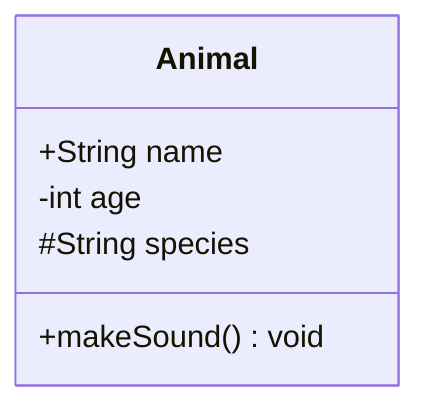
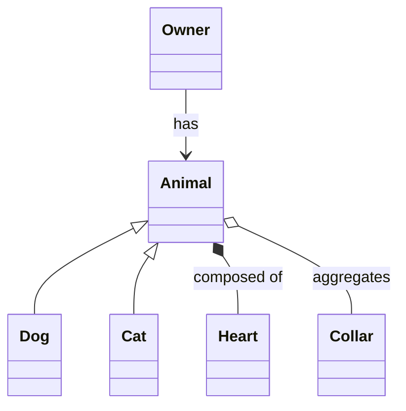
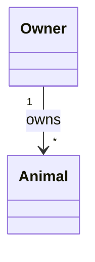
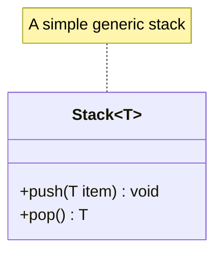

# Class Diagrams

## Basic class with members

```
class Animal {
  +String name
  -int age
  #String species
  +makeSound() void
}
```



Visibility markers: `+` public, `-` private, `#` protected, `~` package/internal.

## Relationships

| Syntax | Meaning |
|--------|---------|
| `A --|> B` | Inheritance (A extends B) |
| `A --* B` | Composition |
| `A --o B` | Aggregation |
| `A --> B` | Association |
| `A ..> B` | Dependency |
| `A ..|> B` | Realization/implements |
| `A -- B` | Solid link, no arrow |
| `A .. B` | Dashed link, no arrow |



## Multiplicity and labels

```
A "1" --> "*" B : contains
```



## Generics and notes


