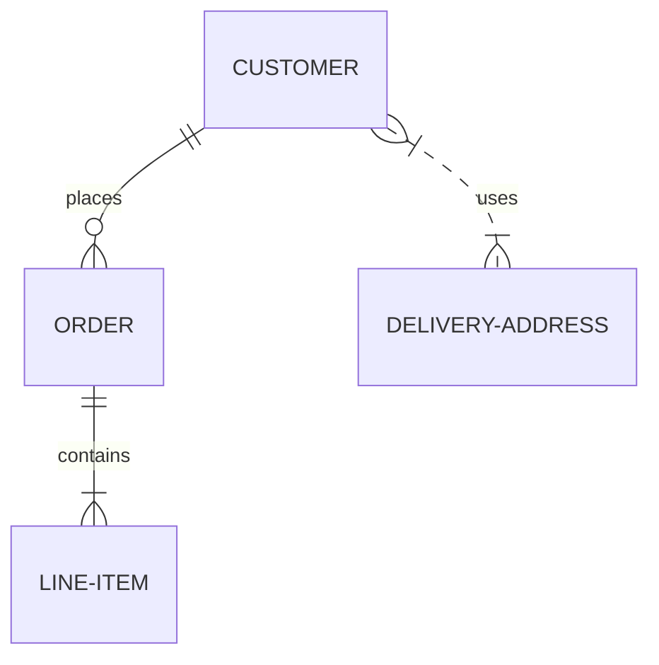
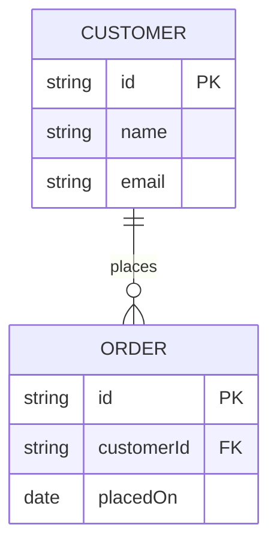

# Entity-Relationship Diagrams

## Basic syntax

```
ENTITY1 ||--o{ ENTITY2 : relationship-label
```



## Cardinality notation

| Left symbol | Meaning |
|-------------|---------|
| `|o` | Zero or one |
| `||` | Exactly one |
| `}o` | Zero or more |
| `}|` | One or more |

Read the pair from each side inward, e.g. `||--o{` = "exactly one" on the left, "zero or more" on the right.

## Attributes



`PK` (primary key) and `FK` (foreign key) are conventional annotations, not required syntax.
