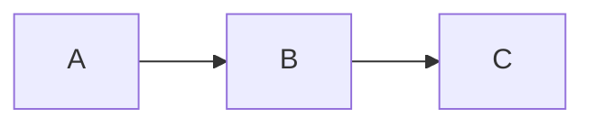
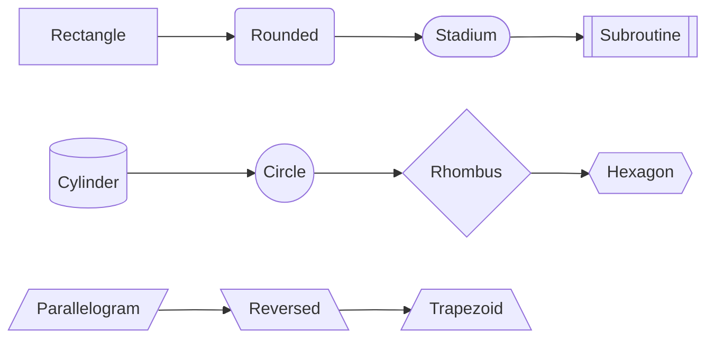
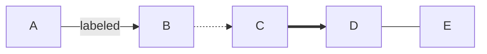
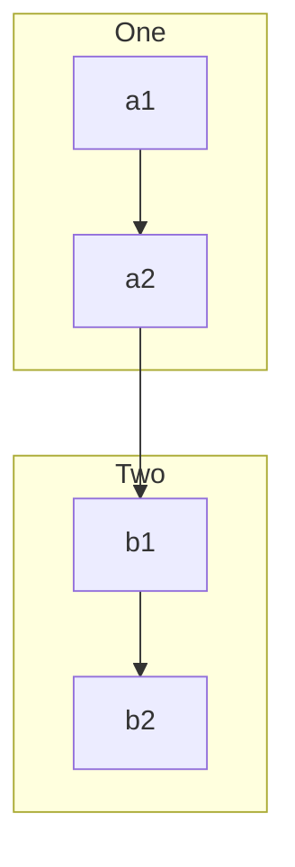
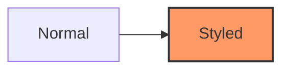

# Flowcharts

## Direction

`graph` (or `flowchart`) followed by a direction: `TD`/`TB` (top-down), `BT` (bottom-up), `LR` (left-right), `RL` (right-left).



## Node shapes

| Syntax | Shape |
|--------|-------|
| `A[Rectangle]` | Rectangle |
| `A(Rounded)` | Rounded rectangle |
| `A([Stadium])` | Stadium (pill) |
| `A[[Subroutine]]` | Subroutine |
| `A[(Cylinder)]` | Cylinder (database) |
| `A((Circle))` | Circle |
| `A{Rhombus}` | Rhombus (decision) |
| `A{{Hexagon}}` | Hexagon |
| `A[/Parallelogram/]` | Parallelogram |
| `A[\Parallelogram alt\]` | Parallelogram (reversed) |
| `A[/Trapezoid\]` | Trapezoid |
| `A[\Trapezoid alt/]` | Trapezoid (reversed) |



## Arrows / edges

| Syntax | Meaning |
|--------|---------|
| `A --> B` | Solid arrow |
| `A --- B` | Solid line, no arrowhead |
| `A -.-> B` | Dotted arrow |
| `A -.- B` | Dotted line, no arrowhead |
| `A ==> B` | Thick arrow |
| `A === B` | Thick line, no arrowhead |
| `A -->|label| B` or `A -- label --> B` | Labeled arrow |
| `A ~~~ B` | Invisible link (layout only) |



## Subgraphs



## Styling

```
style A fill:#f9f,stroke:#333,stroke-width:2px
classDef important fill:#f96
class A,B important
```


