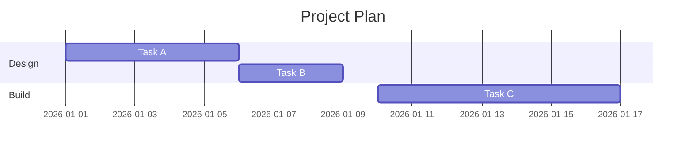
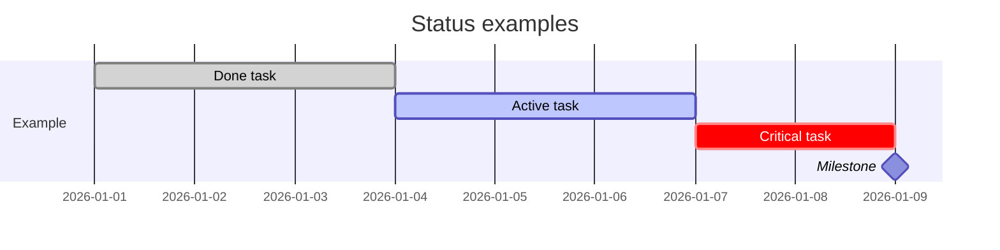

# Gantt Charts

## Basic syntax

```
gantt
title Project Plan
dateFormat YYYY-MM-DD
section Design
Task A :a1, 2026-01-01, 5d
Task B :after a1, 3d
section Build
Task C :2026-01-10, 7d
```



## Task status

| Suffix | Meaning |
|--------|---------|
| `:done, ...` | Rendered as completed |
| `:active, ...` | Rendered as in progress |
| `:crit, ...` | Highlighted as critical |
| `:milestone, ...` | Rendered as a single-point milestone |



## Dependencies

Use `after <id>` (as above) instead of a literal date to chain a task after another one finishes.
