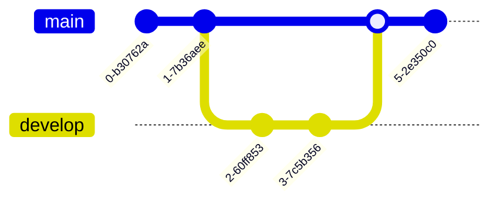

# Git Graphs

```
gitGraph
commit
commit
branch develop
checkout develop
commit
commit
checkout main
merge develop
commit
```



## Common commands

| Command | Meaning |
|---------|---------|
| `commit` | Adds a commit on the current branch (`commit id: "name"` to label it) |
| `branch name` | Creates a new branch from the current one |
| `checkout name` | Switches the current branch |
| `merge name` | Merges the named branch into the current one |
| `cherry-pick id: "..."` | Cherry-picks a specific commit |

Add `tag: "v1.0"` after a commit to label it with a release tag.
