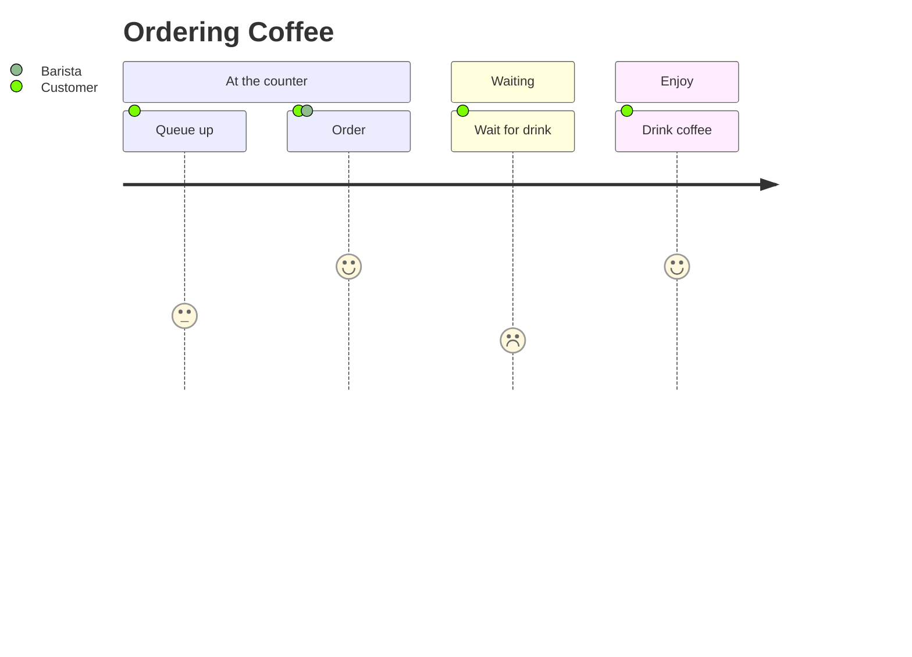

# User Journey Diagrams

```
journey
title Ordering Coffee
section At the counter
  Queue up: 3: Customer
  Order: 5: Customer, Barista
section Waiting
  Wait for drink: 2: Customer
section Enjoy
  Drink coffee: 5: Customer
```



Each task line is `Name: score: Actor(s)`, where the score is a satisfaction rating from 1 (worst) to 5 (best). Multiple actors on one task are comma-separated.
