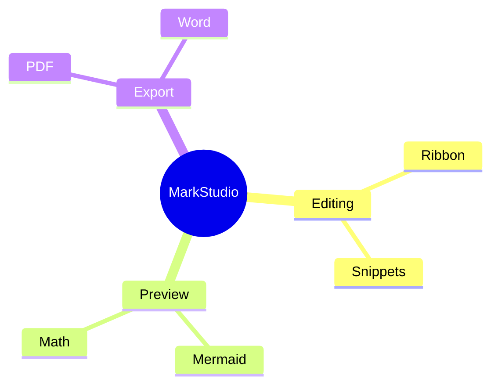

# Mindmaps

```
mindmap
root((MarkStudio))
  Editing
    Ribbon
    Snippets
  Preview
    Mermaid
    Math
  Export
    PDF
    Word
```



Indentation (two spaces per level) controls nesting depth, just like a bullet list. `root((text))` gives the root node a circular shape; other shapes (`[Square]`, `(Rounded)`, `))Cloud((`, `{{Hexagon}}`) are available for any node.
