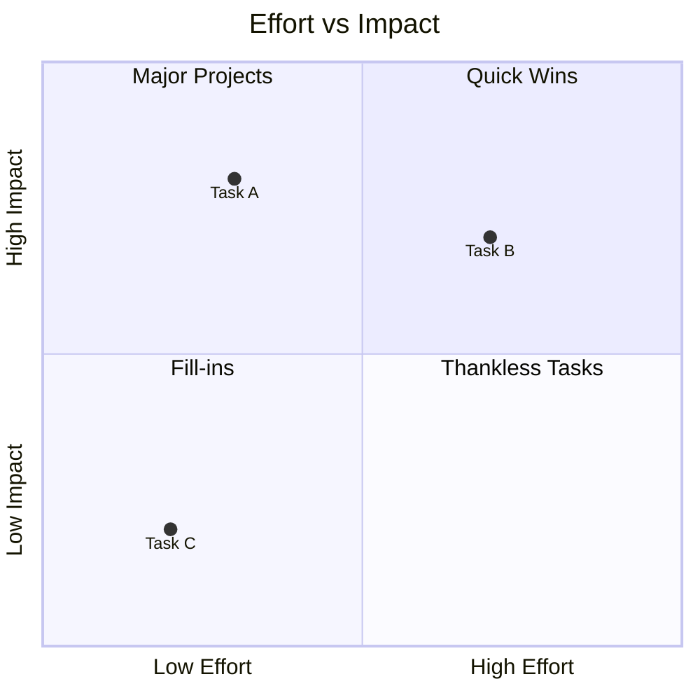
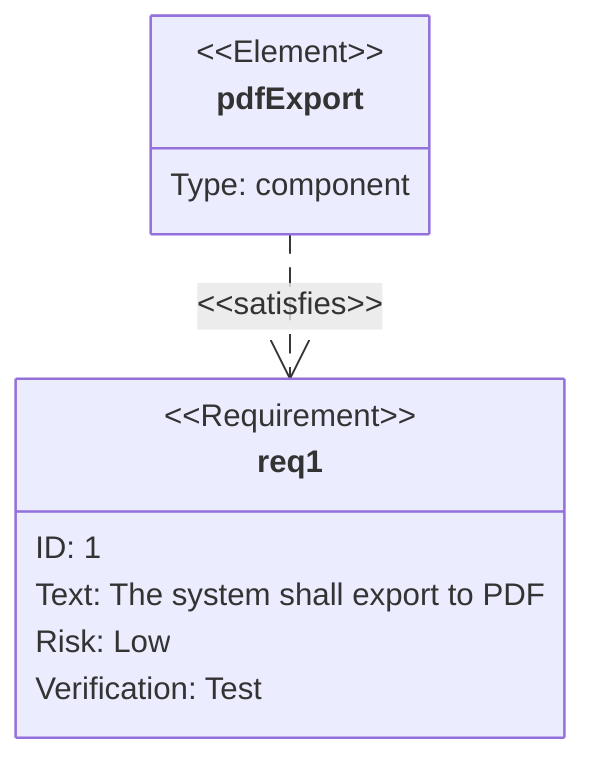
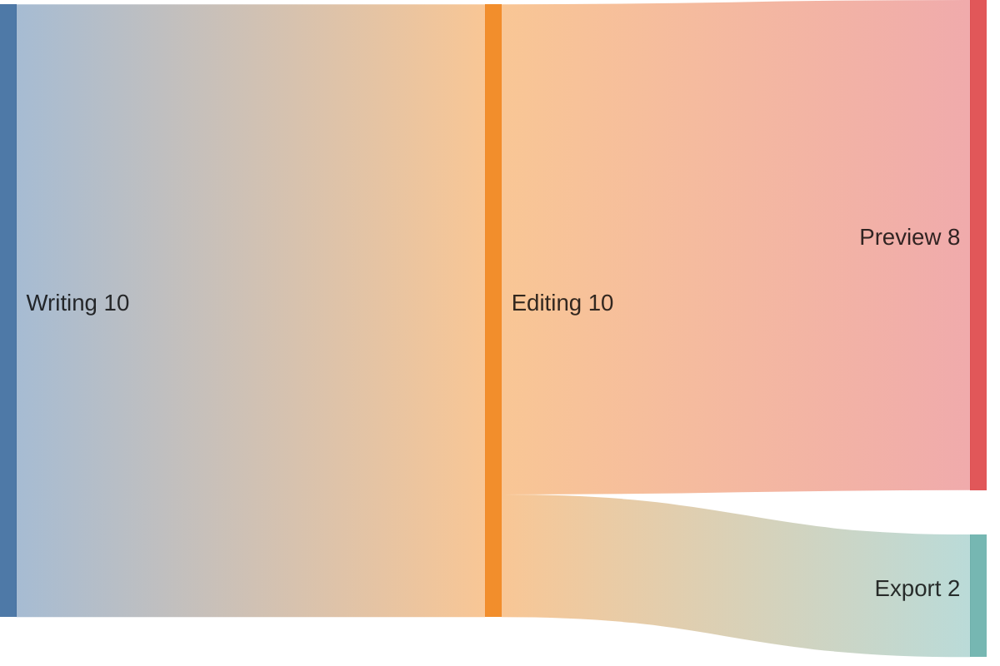
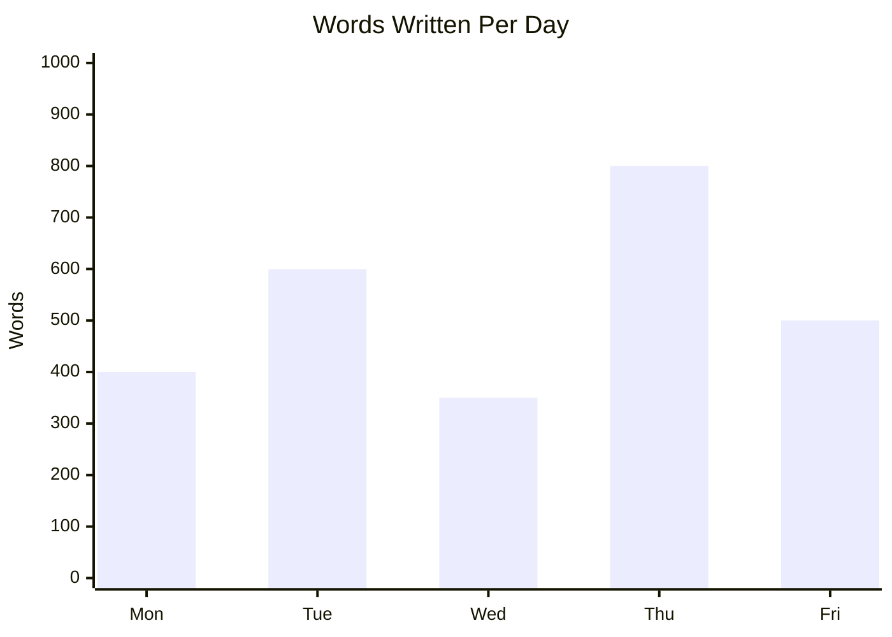
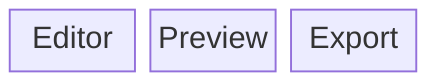

# Other Diagram Types

These are supported by the same bundled Mermaid library but come up less often — included here for completeness.

## Quadrant chart

## Requirement diagram

## Sankey diagram

## XY chart

## Block diagram

Each of these has its own richer option set in the [official Mermaid documentation](https://mermaid.js.org/) if you need more than this quick reference.
