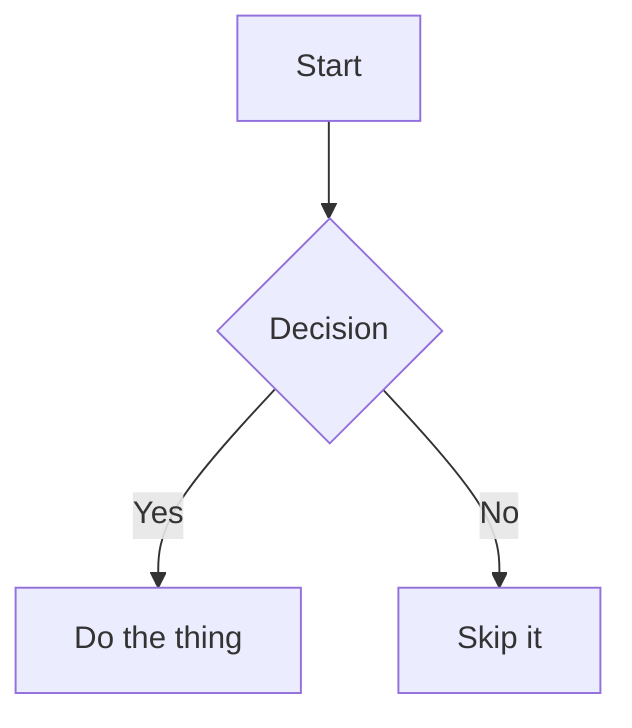

# Mermaid Diagrams — Overview

Fence a block with ` ```mermaid ` and MarkStudio Editor renders it as an actual diagram in the preview, instead of showing the code as text:

````

````


[Mermaid](https://mermaid.js.org/) is bundled locally with the app (no network calls) and loads only when a document actually contains a `mermaid` fence, so ordinary documents preview just as fast as before.

## Diagram types covered in this Help section

- [Flowcharts](flowchart.md) — the most common type: boxes, decisions, arrows
- [Sequence Diagrams](sequence.md) — who calls whom, in what order
- [Class Diagrams](class.md) — object-oriented structure
- [State Diagrams](state.md) — states and transitions
- [Entity-Relationship Diagrams](er.md) — database schemas
- [Gantt Charts](gantt.md) — project timelines
- [Pie Charts](pie.md)
- [User Journey Diagrams](journey.md)
- [Git Graphs](gitgraph.md)
- [Mindmaps](mindmap.md)
- [Timelines](timeline.md)
- [Other Diagram Types](other-diagrams.md) — quadrant charts, requirement diagrams, and more

Every page below shows the full syntax **and** a live example, since the fastest way to learn Mermaid is to see it render.
