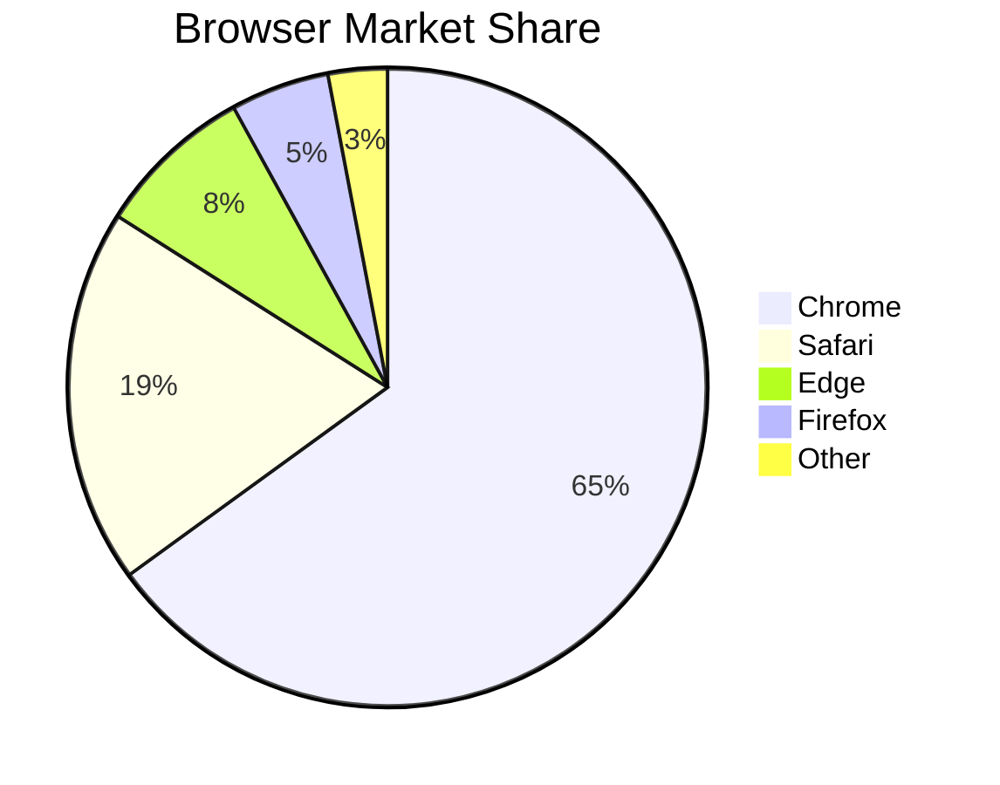

# Pie Charts

```
pie title Browser Market Share
"Chrome" : 65
"Safari" : 19
"Edge" : 8
"Firefox" : 5
"Other" : 3
```



Percentages are calculated automatically from the values you give — they don't need to add up to 100. Add `showData` after the title to display the raw values on the legend instead of percentages.
