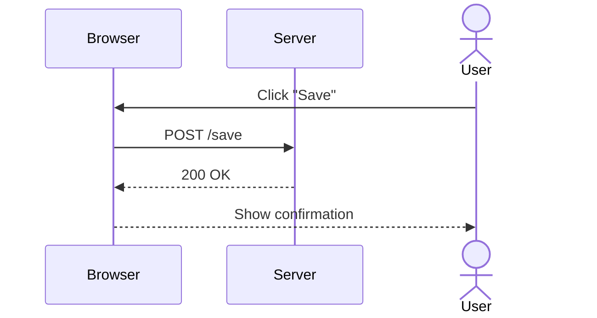
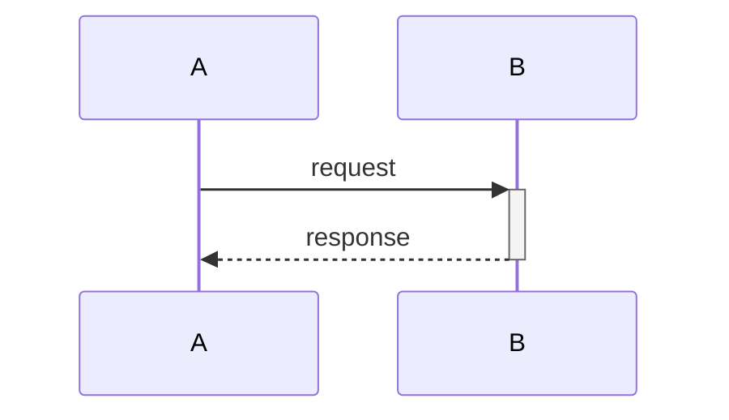
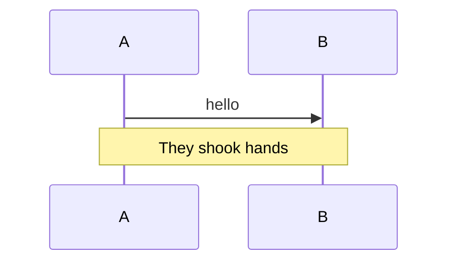
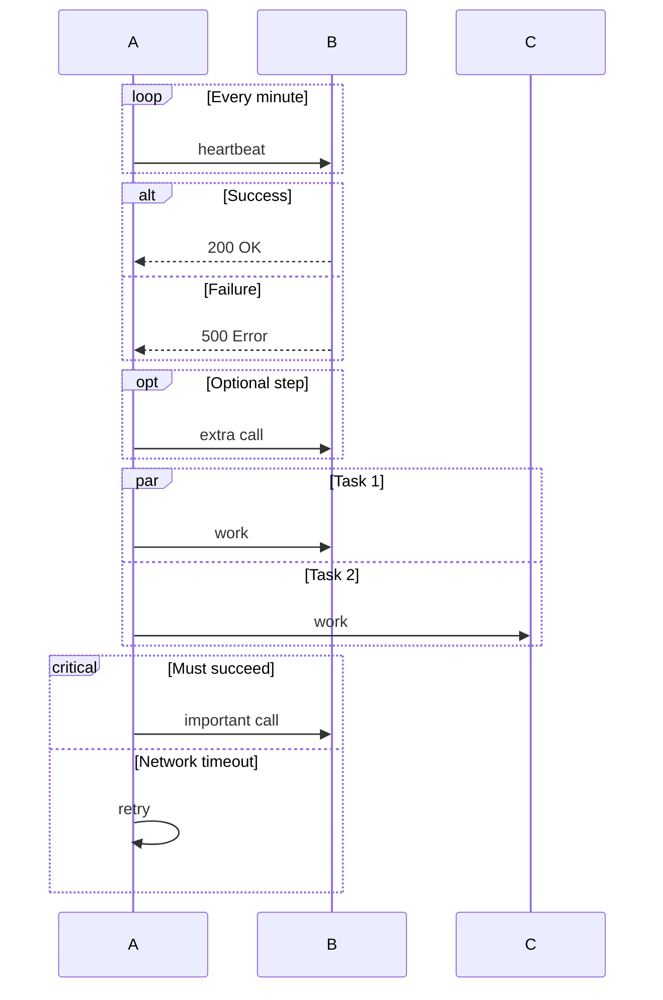
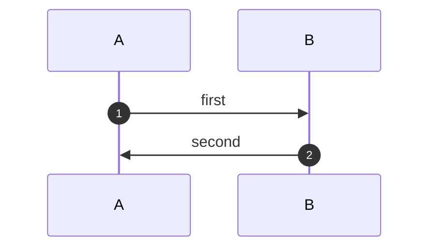

# Sequence Diagrams

## Participants & messages

| Syntax | Meaning |
|--------|---------|
| `participant A` | Declares a participant (box) |
| `actor A` | Declares a participant drawn as a stick figure |
| `A->>B: text` | Solid arrow, filled head (typical synchronous call) |
| `A-->>B: text` | Dashed arrow, filled head (typical response) |
| `A->B: text` | Solid arrow, open head |
| `A-->B: text` | Dashed arrow, open head |
| `A-xB: text` | Solid arrow with an X (failed/async message) |
| `A-)B: text` | Async arrow |



## Activations

```
activate A
...
deactivate A
```
or shorthand `A->>+B: text` (activate) / `B-->>-A: text` (deactivate).



## Notes

```
Note left of A: text
Note right of A: text
Note over A,B: text
```



## Loops, alternatives, parallel, critical



## Autonumbering


