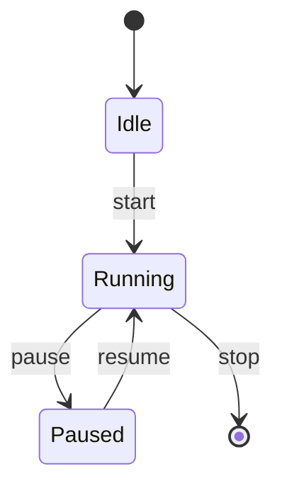
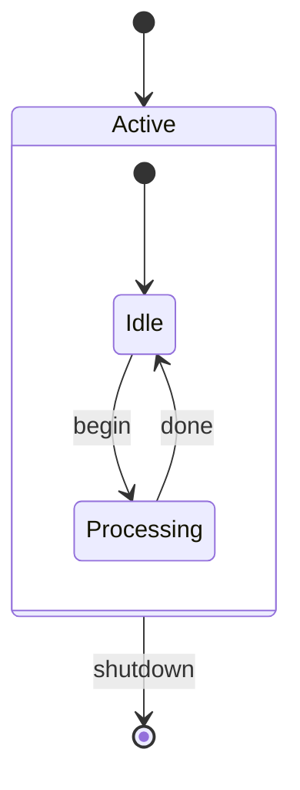
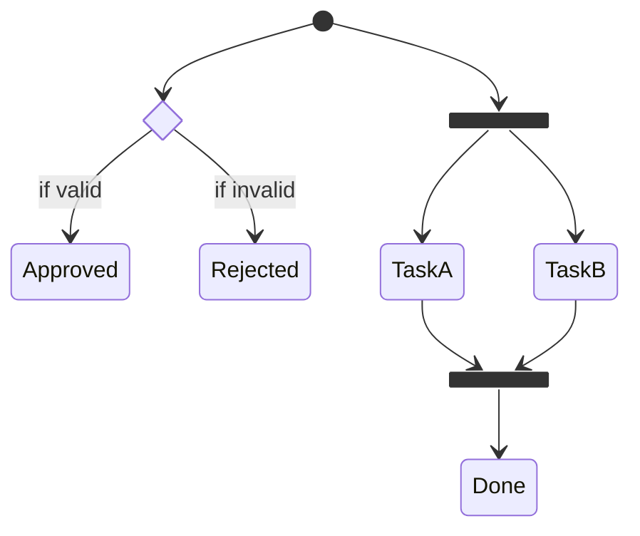
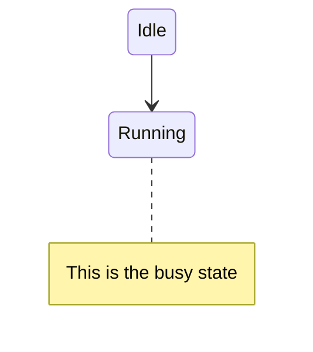

# State Diagrams

## Basic states & transitions

```
[*] --> State1
State1 --> State2 : event
State2 --> [*]
```

`[*]` marks the start (as the source) or end (as the target) of the diagram.



## Composite (nested) states



## Choice, fork, and join



## Notes


