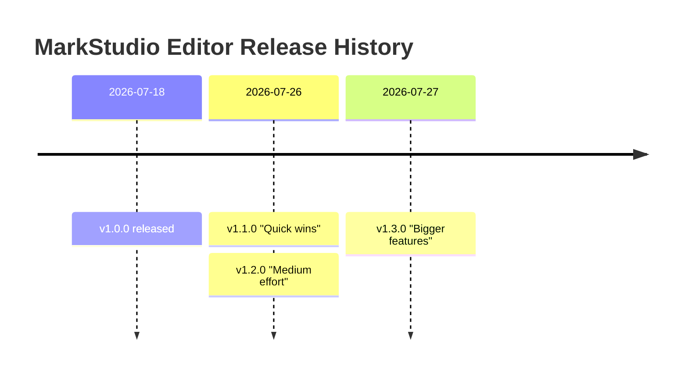

# Timelines

```
timeline
title MarkStudio Editor Release History
2026-07-18 : v1.0.0 released
2026-07-26 : v1.1.0 "Quick wins"
           : v1.2.0 "Medium effort"
2026-07-27 : v1.3.0 "Bigger features"
```



Each line is `period : event`. Multiple events on the same period (like the two v1.1.0/v1.2.0 releases above) are listed on their own indented lines without repeating the period.
